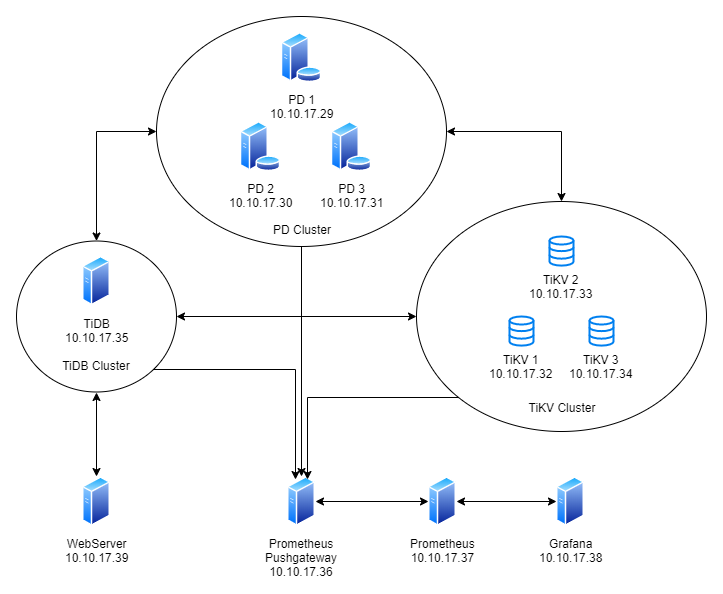
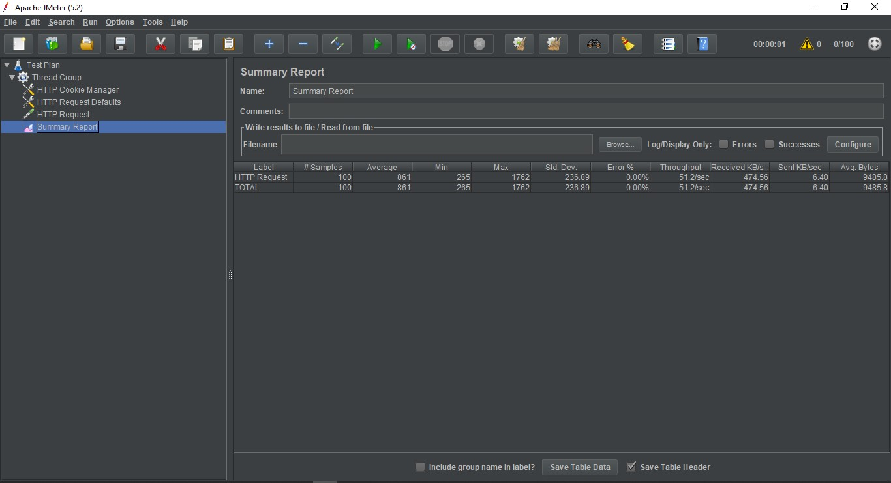
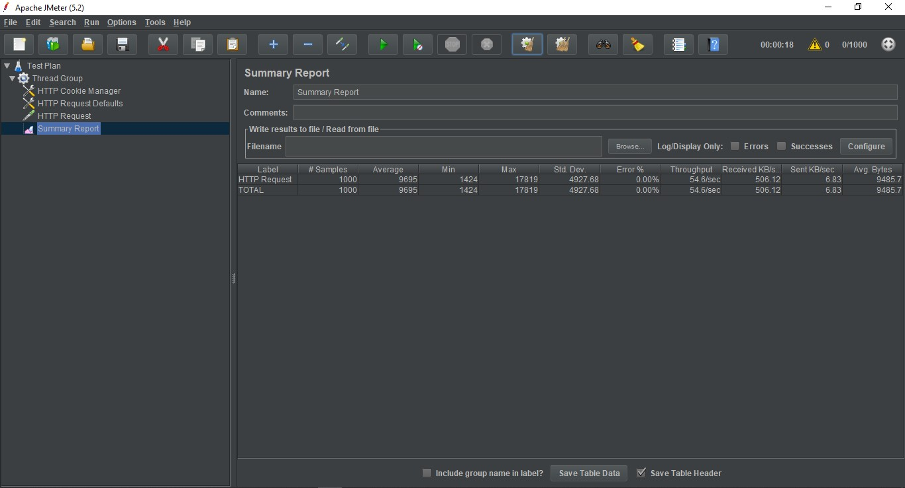
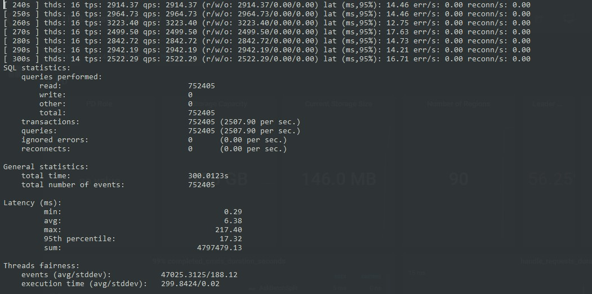
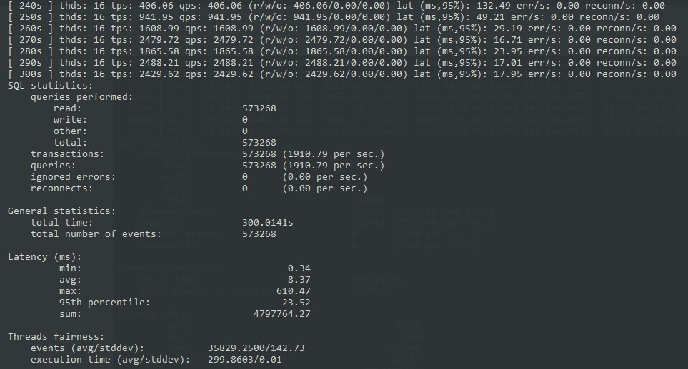
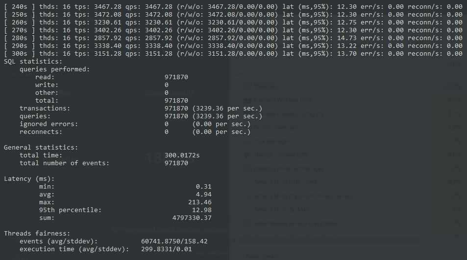
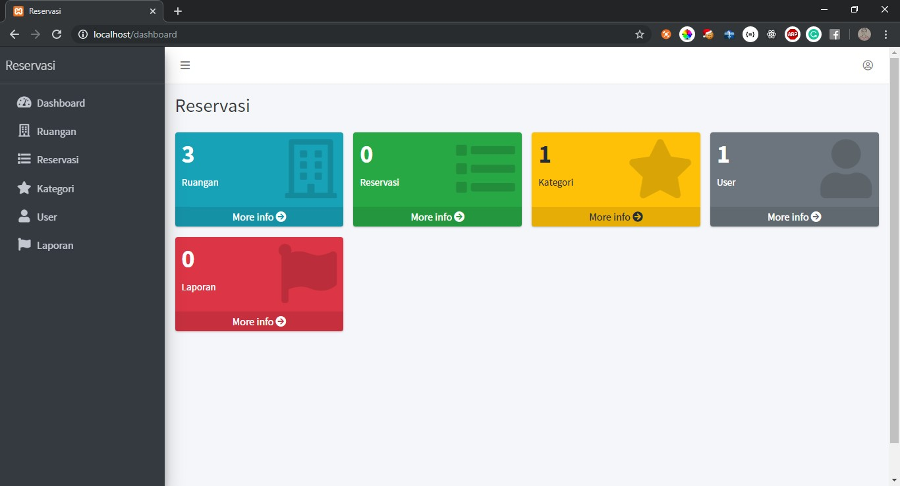
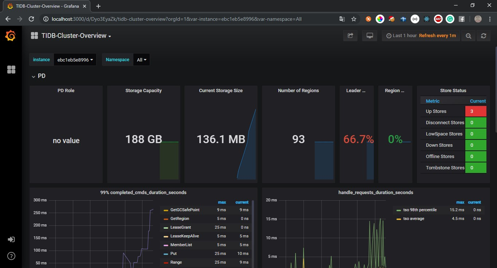

# Final Project BDT

## I. Arsitektur



#### PD Cluster :
- PD 1, IP 10.10.17.29
- PD 2, IP 10.10.17.30
- PD 3, IP 10.10.17.31  
#### TiKV Cluster :
- TiKV 1, IP 10.10.17.32
- TiKV 2, IP 10.10.17.33
- TiKV 3, IP 10.10.17.34
#### TiDB Cluster :
- TiDB, IP 10.10.17.35
#### Monitoring :
- Prometheus Pushgateway, IP 10.10.17.36
- Prometheus, IP 10.10.17.37
- Grafana, IP 10.10.17.38
#### Web Server :
- Web Server, IP 10.10.17.39


## II. Docker Command

### Cara Menjalankan Service (Node)
```bash
docker-compose build

docker-compose --compatibility up
# atau
docker-compose --compatibility up -d
```

### Cara Menjalankan/Menghentikan Single Service (Node)
```bash
docker-compose start <service>
docker-compose stop <service>

# contoh
docker-compose start tikv1
docker-compose stop tikv1
```

### Cara Menghancurkan Semua Service (Node)
```bash
docker-compose down
docker volume rm bdt_fp_pd1 bdt_fp_pd2 bdt_fp_pd3 bdt_fp_tikv1 bdt_fp_tikv2 bdt_fp_tikv3 bdt_fp_prometheus bdt_fp_grafana bdt_fp_web_server
```


## III. Uji Performa & Failover

### Uji performa dengan JMeter

#### Cara Penggunaan
1. Download JMeter
2. Tambahkan Thread Group, HTTP Cookie Manager, HTTP Request Defaults, HTTP Request, dan Summary Report
3. Pada HTTP Request Defaults ganti Server Name dengan lokasi wordpress yang telah diinstall
4. Pada HTTP Request pilih path dari post yang ada di wordpress
5. Jalankan testing

#### Hasil
1. Pada 100 Client
    

2. Pada 500 Client
    

3. Pada 1000 Client
    


### Uji performa dengan Sysbench

#### Cara Penggunaan
1. Masuk ke node testing_client
    ``` bash
    docker-compose.exe exec testing_client bash
    ```
2. Ganti directory ke `~/sysbench`
    ``` bash
    cd ~/sysbench
    ```
3. Jalankan perintah berikut
    ``` bash
    ./run.sh point_select prepare 16
    ./run.sh point_select run 16 &
    # Angka 16 adalah jumlah thread yang digunakan
    ```
4. Lihat hasil pada file `~/sysbench/point_select_run_jumlahThread.log`
    ```bash
    tail -f ~/sysbench/point_select_run_16.log
    ```
5. (Opsional) Untuk menghentikan service tidb/pd/tikv dengan cara berikut
    ```bash
    docker-compose stop tikv1
    ```

#### Hasil
1. Dengan 3 PD Server + 3 TiKV Server
    

2. Dengan 2 PD Server + 3 TiKV Server
    
    
3. Dengan 3 PD Server + 2 TiKV Server
    


## IV. Cara Akses Aplikasi

### Webserver
- Webserver dapat dibuka dengan mengakses `localhost`
- Pastikan sebelum menjalankan `docker-compose up` port 80 tidak sedang digunakan!
- Tampilan
    

### Grafana
- Grafana dapat dibuka melalui `localhost:3000`
- User password yang dapat digunakan
    ```text
    Username : admin
    Password : admin
    ```
- Pastikan sebelum menjalankan `docker-compose up` port 3000 tidak sedang digunakan!
- Tampilan
    

### TiDB
- TiDB dapat diakses melalui `localhost:4000`
- Pastikan sebelum menjalankan `docker-compose up` port 4000 dan 10080 tidak sedang digunakan!
- User password yang dapat digunakan
    ```text
    Username : root
    Password (empty) : 
    ```
    
### Prometheus
- Prometheus dapat diakses melalui `localhost:9090`
- Pastikan sebelum menjalankan `docker-compose up` port 9090 tidak sedang digunakan!
